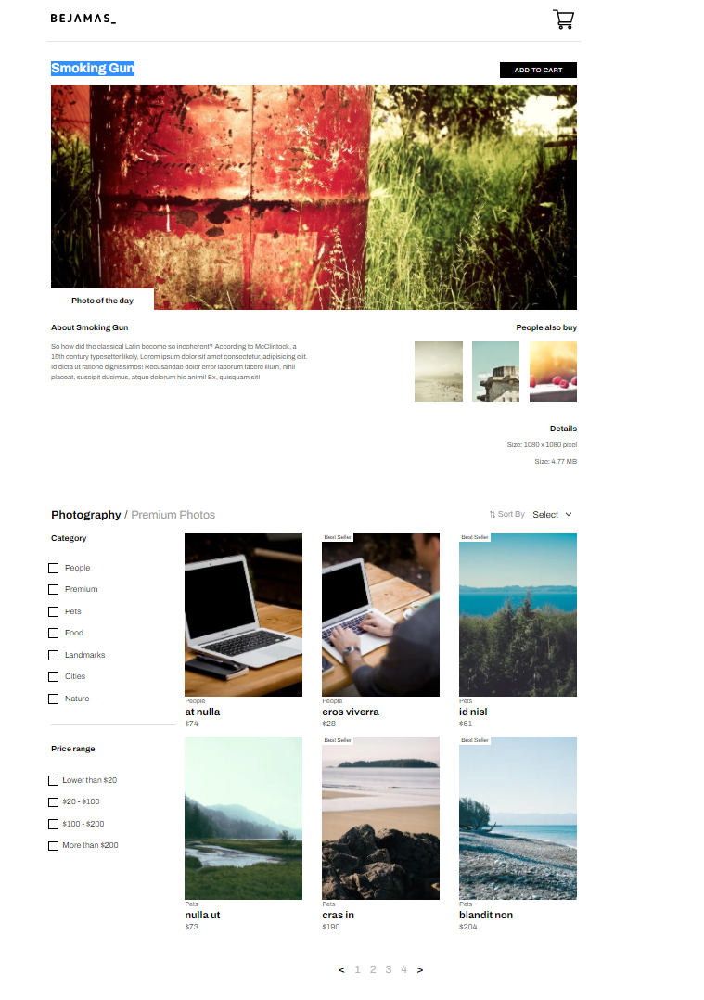

# E-Commerce Proof of Concept

An E-commerce of proof concept to show the basic functionalities of an E-commerce site.

This E-Commerce prototype was created using Nextjs and a React Application at its core. It backend is written with Firestore and the application is very much Dynamic.The application allows its user to accomplish some of the basic e-commerce functionalities. This application is performant and accessibility compliant.

&nbsp;

## Built With

- JavaScript, TypeScript, React,Next.js
- Hooks, Redux, Redux thunk,
- Sass, styles JSX, bootstrap.
- Firestore.

&nbsp;

## Live Demo

[Live Demo Link](https://radio-widget-three.vercel.app/)

&nbsp;

## Getting Started

To get a local copy up and running follow these simple example steps.

### Prerequisites

To run this project, you will need to have `node`,`npm` or `yarn`, `TypeScript` already installed locally

### Setup

`cd into the directory with command line terminal`

### Install

run `npm install` or `yarn install` to install all the dependencies of the project

### Usage

run `npm start` or `yarn start` to get the project running

open browser and navigate to `http://localhost:3000/`

## Features

- ✔️ Featured Product
- ✔️ Product List,
- ✔️ Add to Cart
- ✔️ Sorting
- ✔️ Filtering
- ✔️ Web performant
- ✔️ API implementation

### Customizations

The styles are written using SASS and styled JSX, some components have custom styles written in them with Styles Jsx.

To tweak react components navigate to `/components`

To theme component global styles navigate to `/components/useTheme.tsx`

To access global bootstrap styles navigate to `/styles/main.scss`

&nbsp;

## Deployment

run `npm build` or `yarn build` to generate build folder. You can now serve the build folder on any static server. for more information visit [https://nextjs.org/docs/deployment](https://nextjs.org/docs/deployment).

&nbsp;

## Authors

👤 **Author**

- Github: [solomonakp](https://github.com/solomonakp)
- twitter: [@dev_chuck](https://twitter.com/dev_chuck)

&nbsp;

&nbsp;

## 📝 License

This project is [MIT](lic.url) licensed.
